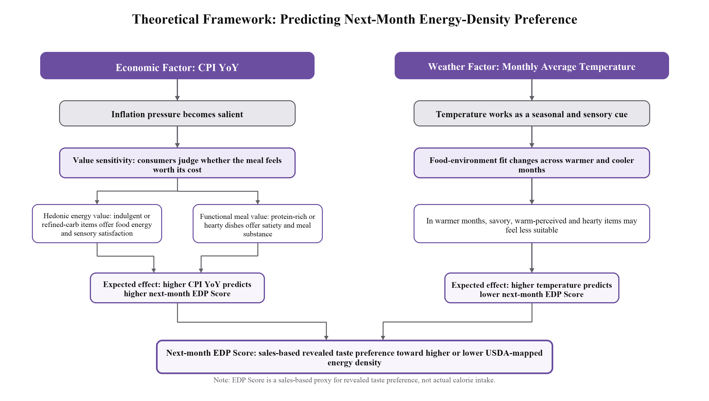
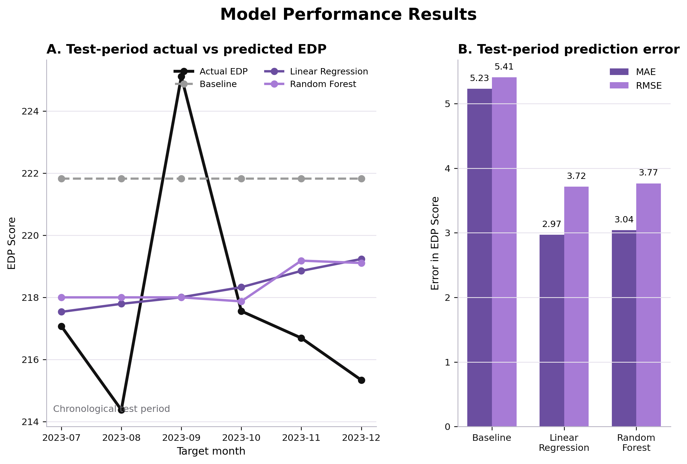

# IOM209 Business Intelligence: Restaurant Preference Forecasting

This repository contains my individual IOM209 analysis of how inflation and weather relate to restaurant customers' food energy-density preferences. It turns 17,534 Bistro sales records from January 2022 to December 2023 into a monthly Energy-Density Preference (EDP) score, combines that score with CPI and Austin temperature data, compares two predictive models with a historical-mean baseline, and produces conditional forecasts for January to March 2024.

The work began from the cleaned sales data and business context developed in the [IOM209 group repository](https://github.com/Alex-jjh/ay2526-iom209-restaurant-sales). The code and provenance for that early record-cleaning stage are preserved under `upstream/group_cleaning/` with explicit group attribution. Customer-level sales files are kept out of this public repository; their exact upstream source, dimensions, and checksums are documented there. The main pipeline focuses on my individual extension: the USDA food mapping, dependent-variable construction, external-factor preparation, modelling, evaluation, and forecast pipeline.

## Where the modelling and regression code is

The submitted individual analysis is split into four numbered scripts rather
than one long `individual_analysis.py` file. The full regression, model
evaluation, factor-influence, and forecasting implementation is in
[`scripts/04_run_models.py`](scripts/04_run_models.py). It contains:

- an 18-month chronological training set and six-month test set;
- a historical-mean baseline;
- `LinearRegression` and `RandomForestRegressor` models;
- MAE, RMSE, and R-squared calculations;
- linear coefficients and Random Forest feature importance;
- January-March 2024 forecast assumptions and predictions; and
- the model-performance, factor-influence, and forecast figures.

The earlier BCF target with CPI and Austin tech layoffs was recovered from the
Workplace folder and is preserved separately under
[`archive/bcf_cpi_layoffs/`](archive/bcf_cpi_layoffs/HISTORICAL_ANALYSIS.md). It
is historical work and is not the model reported in the final individual
submission.



## Research design

The dependent variable is the monthly sales-weighted estimated food energy density:

`EDP = sum(USDA kcal per 100g × quantity sold) / sum(quantity sold)`

Menu items are matched to comparable foods in USDA FoodData Central FNDDS 2021-2023. Drinks are outside the scope of the food-energy measure. The Vegetarian Platter is excluded because its ingredients are unspecified, and unknown items are recovered only where category and price identify one defensible mapped item. The final mapping covers 38,894 of 42,326 food portions (91.9%).

The predictors are:

- US CPI year-on-year change, calculated from FRED series `CPIAUCSL`.
- Austin monthly average temperature, aggregated from daily weather observations.

The first 18 months form the training period and the final six months form the chronological test period. Linear Regression and Random Forest are compared with a historical-mean baseline.

## Main results

| Model | MAE | RMSE | Test R² |
|---|---:|---:|---:|
| Historical mean | 5.23 | 5.41 | -1.40 |
| Linear Regression | 2.97 | 3.72 | -0.14 |
| Random Forest | 3.04 | 3.77 | -0.17 |

Both fitted models reduced MAE relative to the baseline, but their negative test R² values show that neither model explains the six-month holdout well. The forecasts should therefore be read as scenario estimates under explicit CPI and temperature assumptions, not as high-confidence predictions.



The January-March 2024 assumptions hold CPI YoY at the Q4 2023 average and use the 2022-2023 average temperature for each calendar month. The resulting estimates are available in [`results/tables/forecast_jan_mar_2024.csv`](results/tables/forecast_jan_mar_2024.csv).

## Repository structure

```text
archive/
  bcf_cpi_layoffs/     Recovered earlier analysis, clearly marked non-final
upstream/
  group_cleaning/      Step 1 notebook, menu lookup, and DATA_PROVENANCE.md
data/
  raw/                 Local-only Bistro sales input (setup instructions below)
  external/            CPI and Austin weather inputs
  processed/           Final 24-month modelling dataset
scripts/
  00_prepare_sales_input.py
  01_build_energy_mapping.py
  02_build_external_factors.py
  03_build_model_dataset.py
  04_run_models.py      Regression, evaluation, and Jan-Mar 2024 forecasts
results/
  figures/             Report-ready visual outputs
  tables/              Metrics, predictions, factor influence, and forecasts
tests/
  test_outputs.py      Completeness and portability checks
run_pipeline.py        Runs the four analysis stages in order
```

Intermediate order-level files are regenerated under `data/derived/` and are excluded from version control.

## Data lineage and contribution boundary

The project has two connected layers:

1. **Group-stage foundation.** `upstream/group_cleaning/` preserves the Step 1 notebook, menu lookup, and a manifest for the original, cleaned, and enriched 17,534-row files from the group repository. The notebook handles missing values, recalculates order totals, creates calendar fields, and adds menu attributes. These files are group work and are identified as traceable upstream inputs.
2. **Individual analysis.** `run_pipeline.py` and the four scripts under `scripts/` build the energy-density measure, prepare CPI and weather variables, form the 24-month modelling table, evaluate the models, and create the 2024 scenario forecasts.

The historical notebook is preserved for inspection and provenance rather than called by the automated individual pipeline. This keeps the original group work intact while making the starting point of the individual analysis visible.

## Reproduce the analysis

Python 3.11 or newer is recommended.

```bash
python -m venv .venv
source .venv/bin/activate
pip install -r requirements.txt
python scripts/00_prepare_sales_input.py --source /path/to/restaurant_sales_data_enriched.csv
python run_pipeline.py
python -m unittest discover -s tests
```

The source CSV is available in the group repository at
`data/cleaned/restaurant_sales_data_enriched.csv`. The preparation command
creates the local-only `data/raw/the_bistro_data_final.xlsx` expected by the
pipeline. It is deliberately ignored by Git because it contains customer-level
order records.

The pipeline uses repository-relative paths and does not depend on the original author's local folders.

## Data and interpretation notes

- USDA values are comparable-food labels rather than nutrition measurements of the Bistro's actual recipes or portions.
- The dataset has only 24 monthly observations, leaving six observations for chronological testing.
- Forecast inputs for 2024 are assumptions derived from the 2022-2023 period; actual 2024 sales and external data are not used.
- Model associations do not establish that CPI or temperature caused the observed changes in food preference.

## Sources and attribution

- Group context and cleaned sales pipeline: [Alex-jjh/ay2526-iom209-restaurant-sales](https://github.com/Alex-jjh/ay2526-iom209-restaurant-sales)
- CPI: [Federal Reserve Bank of St. Louis, CPIAUCSL](https://fred.stlouisfed.org/series/CPIAUCSL)
- Food energy-density references: [USDA FoodData Central](https://fdc.nal.usda.gov/)
- Weather input: the Austin daily weather file collected for the group project

The code in this repository is released under the MIT License. Source datasets remain subject to their original terms.
